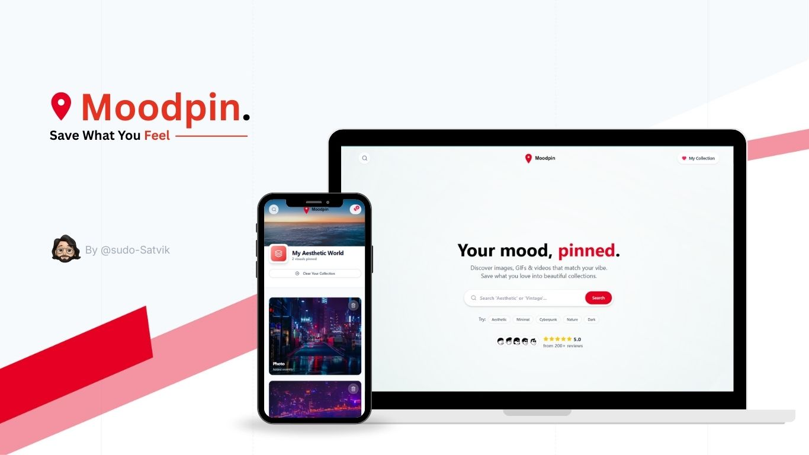
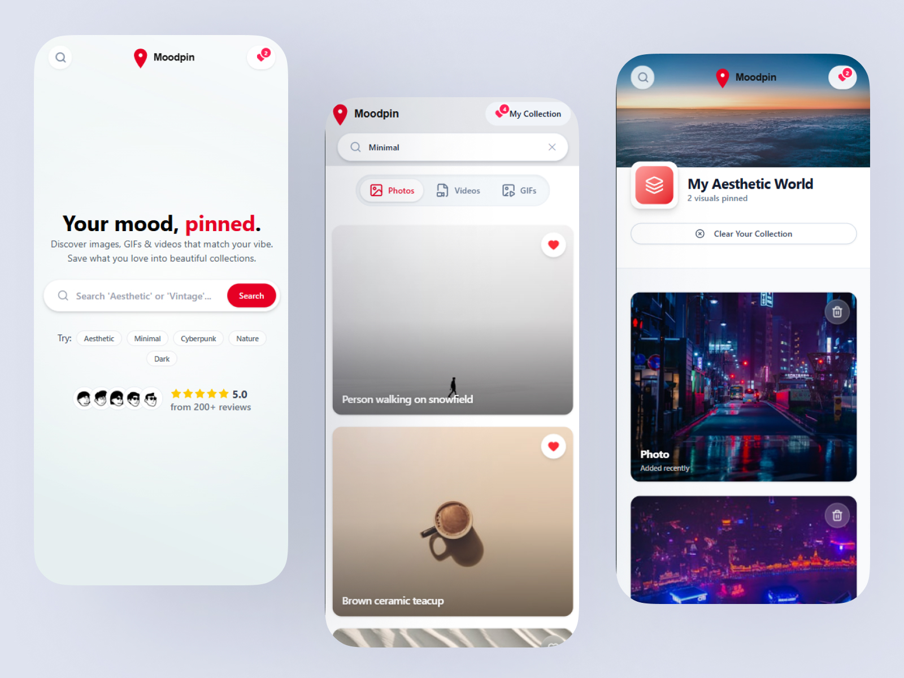
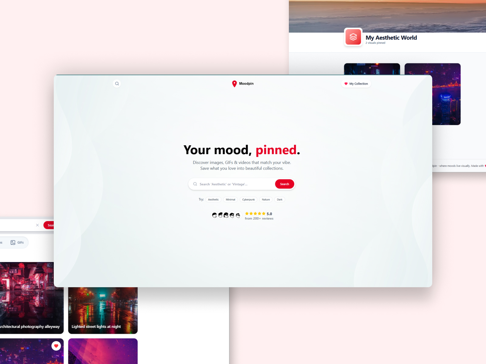

<div align="center">


# MoodPin

**A modern media discovery platform** - Search and collect images, videos, and GIFs from multiple sources

<p><b>Powered By</b></p>


<br />


[Demo](#-screenshots--demo) • [Features](#-features) • [Tech Stack](#-tech-stack) • [Getting Started](#-getting-started) • [Project Structure](#-project-structure) • [Environment Variables](#-environment-variables)

</div>

---

## 📸 Screenshots & Demo

### Demo

<div align="center">


_Interactive demo showcasing MoodPin's search and collection features_

</div>

### Screenshots

<div align="center">



#### Mobile View



#### Desktop View



</div>

---

## ✨ Features

- 🔍 **Multi-source Search** - Search images, videos, and GIFs from Unsplash, Pexels, and Tenor
- 💾 **Collections** - Save your favorite media to your personal collection
- 🎨 **Modern UI** - Beautiful, responsive design with smooth animations
- ⚡ **Fast Performance** - Built with Vite for lightning-fast development and builds
- 📱 **Responsive Design** - Works seamlessly on desktop, tablet, and mobile devices
- 🎭 **Mood-based Discovery** - Find media that matches your current mood

## 🛠️ Tech Stack

### Core

- **React 19** - UI library
- **TypeScript** - Type safety
- **Vite** - Build tool and dev server

### State Management

- **Redux Toolkit** - State management
- **React Redux** - React bindings

### Styling & UI

- **Tailwind CSS 4** - Utility-first CSS framework
- **shadcn/ui** - Re-usable components built with Radix UI and Tailwind CSS
- **Radix UI** - Accessible component primitives
- **Framer Motion** - Animation library
- **Lucide React** - Icon library

### Routing & HTTP

- **React Router DOM v7** - Client-side routing
- **Axios** - HTTP client

### Notifications & Utilities

- **React Toastify** - Beautiful toast notifications
- **Class Variance Authority** - Component variants

## 🚀 Getting Started

### Prerequisites

- **Node.js** 18+ and npm/yarn/pnpm
- API keys for:
  - [Unsplash API](https://unsplash.com/developers)
  - [Pexels API](https://www.pexels.com/api/)
  - [Tenor API](https://developers.google.com/tenor/guides/quickstart)

### Installation

1. **Clone the repository**

   ```bash
   git clone https://github.com/sudo-Satvik/mood-pin
   cd mood-pin
   ```

2. **Install dependencies**

   ```bash
   npm install
   # or
   yarn install
   # or
   pnpm install
   ```

3. **Set up environment variables**

   Create a `.env` file in the root directory:

   ```env
   VITE_UNSPLASH_KEY=your_unsplash_api_key
   VITE_PEXELS_KEY=your_pexels_api_key
   VITE_TENOR_API_KEY=your_tenor_api_key
   ```

4. **Start the development server**

   ```bash
   npm run dev
   # or
   yarn dev
   # or
   pnpm dev
   ```

5. **Open your browser**

   Navigate to `http://localhost:5173` (or the port shown in your terminal)

### Build for Production

```bash
npm run build
# or
yarn build
# or
pnpm build
```

Preview the production build:

```bash
npm run preview
# or
yarn preview
# or
pnpm preview
```

## 📁 Project Structure

```
mood-pin/
├── public/                 # Static assets
├── src/
│   ├── api/               # API service functions
│   │   └── media.ts       # Media fetching logic
│   ├── assets/            # Images, SVGs, etc.
│   ├── components/        # React components
│   │   ├── collection/    # Collection-related components
│   │   ├── common/        # Shared components
│   │   ├── home/          # Landing page components
│   │   ├── search/        # Search-related components
│   │   └── ui/            # Reusable UI components
│   ├── constants/         # App constants
│   ├── lib/               # Utility libraries
│   ├── pages/             # Page components
│   ├── routes/            # Routing configuration
│   ├── store/             # Redux store
│   │   └── slices/        # Redux slices
│   ├── types/             # TypeScript type definitions
│   ├── utils/             # Utility functions
│   ├── App.tsx            # Root component
│   └── main.tsx           # Entry point
├── components.json         # shadcn/ui configuration
├── vite.config.ts          # Vite configuration
└── package.json            # Dependencies
```

## 🔐 Environment Variables

Create a `.env` file in the root directory with the following variables:

| Variable             | Description             | Required |
| -------------------- | ----------------------- | -------- |
| `VITE_UNSPLASH_KEY`  | Unsplash API access key | Yes      |
| `VITE_PEXELS_KEY`    | Pexels API key          | Yes      |
| `VITE_TENOR_API_KEY` | Tenor API key           | Yes      |

### Getting API Keys

1. **Unsplash**: Sign up at [Unsplash Developers](https://unsplash.com/developers) and create an application
2. **Pexels**: Sign up at [Pexels API](https://www.pexels.com/api/) and get your API key
3. **Tenor**: Follow the [Tenor Quickstart Guide](https://developers.google.com/tenor/guides/quickstart) to get your API key

## 📜 Available Scripts

| Script            | Description              |
| ----------------- | ------------------------ |
| `npm run dev`     | Start development server |
| `npm run build`   | Build for production     |
| `npm run preview` | Preview production build |
| `npm run lint`    | Run ESLint               |

## 🎯 Key Features Explained

### Search Functionality

- Search across multiple media types (images, videos, GIFs)
- Real-time search with debouncing
- Tab-based filtering by media type

### Collections

- Save media to your personal collection
- Persistent storage using Redux
- Easy access from navigation

### Responsive Design

- Mobile-first approach
- Optimized layouts for all screen sizes
- Touch-friendly interactions

## 🤝 Contributing

Contributions are welcome! Please feel free to submit a Pull Request.

1. Fork the repository
2. Create your feature branch (`git checkout -b feature/AmazingFeature`)
3. Commit your changes (`git commit -m 'Add some AmazingFeature'`)
4. Push to the branch (`git push origin feature/AmazingFeature`)
5. Open a Pull Request

## 📝 License

This project is licensed under the MIT License - see the LICENSE file for details.

## 🙏 Acknowledgments

- [Unsplash](https://unsplash.com/) for providing the image API
- [Pexels](https://www.pexels.com/) for providing the video API
- [Tenor](https://tenor.com/) for providing the GIF API
- All the amazing open-source libraries that made this project possible

---

<div align="center">

Made with ❤️ using React, TypeScript, and Vite

**Star this repo if you find it helpful! ⭐**

</div>
